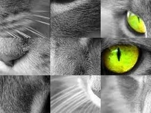

#Auto Puzzle Reconstruction
The project is to solve reconstruction puzzle problem.
It use ant colony optimization algorithm.

##Example:

input image

Then we split the image 2 * 2 pieces 

##Usage:  
    cd script  
    python script-split.py ../image/lena.jpg 2 2

like this:

