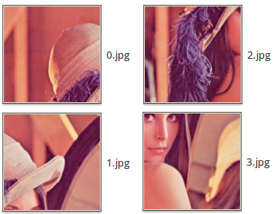

#Auto Puzzle Reconstruction
The project is to solve reconstruction puzzle problem.
It use ant colony optimization algorithm.

##Example:

input image

Then we split the image 2 * 2 pieces,and random sorted it.

    cd script
    python script-split.py ../image/lena.jpg 2 2
    python script-random.py

in random_output folder
like this

or split 3 * 3

We use Enumerate algorithm to calcate each combine of piece and otherise

    python script-puzzle random_output 2 2 lena

now the diricetion has lena.sol file
the file is store all combination information of pieces

We need output the lena.sol image

    python script-show lena.sol

Now, in script/solu_output folder
you can see many image of pieces combination

like this

